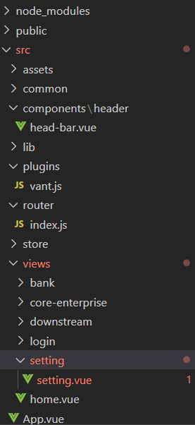
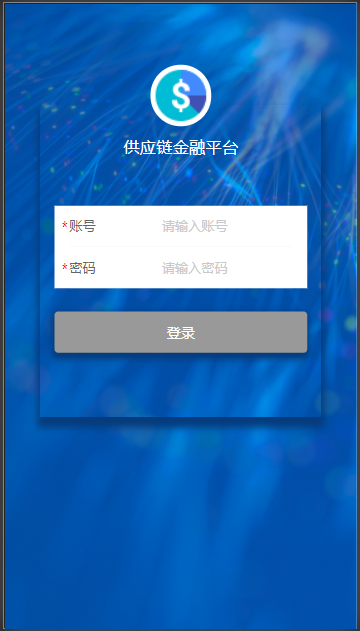
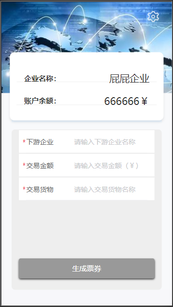
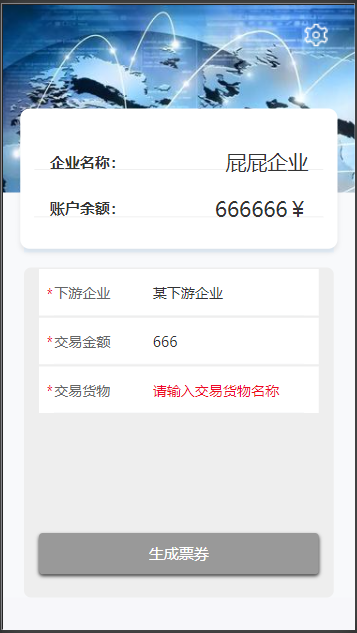
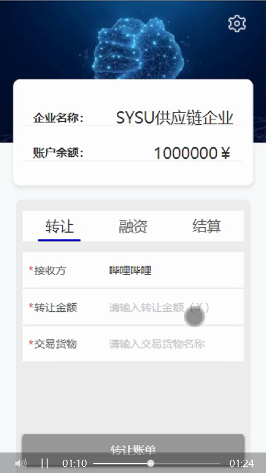
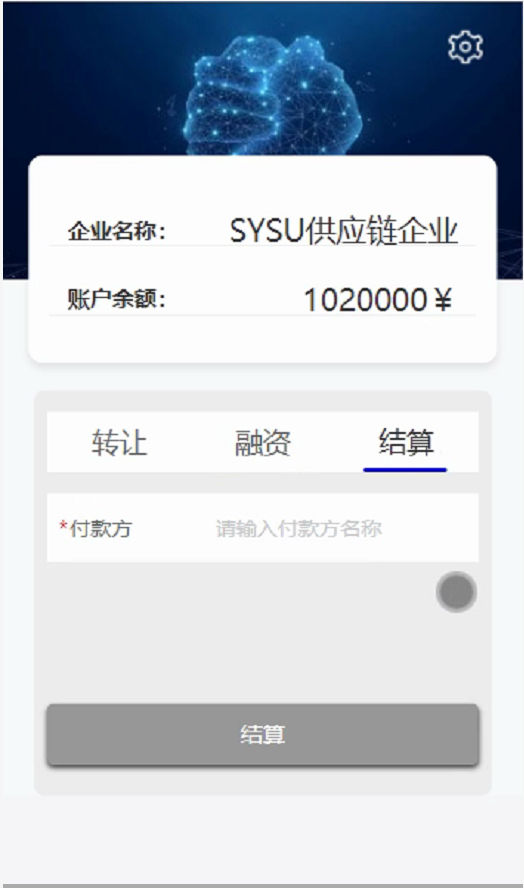
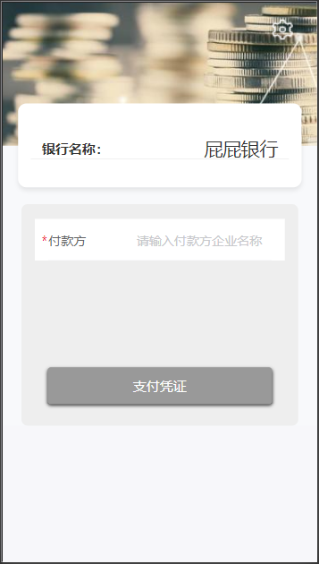
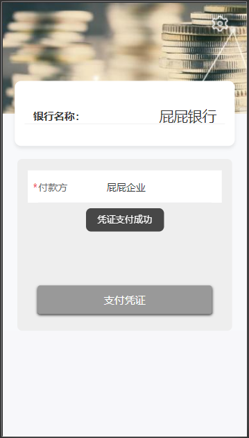
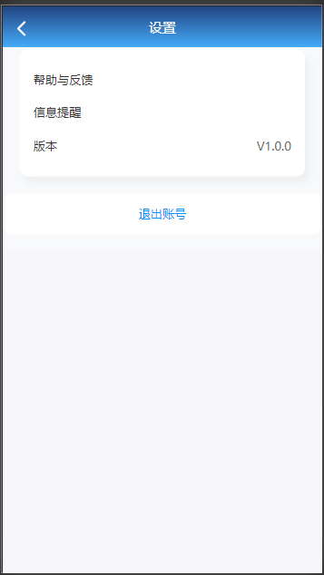
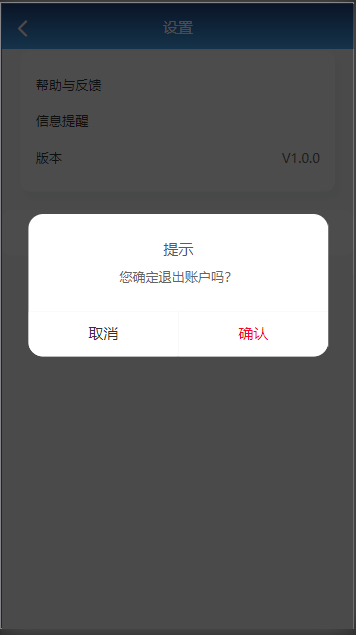

## 前端

### 项目开发介绍

项目开发环境 win 10

#### 准备工作

我们的项目前端部分是基于 Vue 框架来实现的，因此要获取和尝试运行项目需要搭建 vue-cli，也就死前端框架的脚手架。  需要安装 node js（内置 npm），然后直接使用 npm 安装 vue-cli 和其他组件。

#### 项目框架

 

#### 项目运行截图

|                           登录页面                           |                          提示信息                           |
| :----------------------------------------------------------: | :---------------------------------------------------------: |
|  |  |

|                           核心企业                           |                        信息完整性检查                        |
| :----------------------------------------------------------: | :----------------------------------------------------------: |
|  |  |

 

|                       下游企业--转让                        |                       下游企业--融资                        |
| :---------------------------------------------------------: | :---------------------------------------------------------: |
|  |  |


|                        下游企业--结算                        |
| :----------------------------------------------------------: |
|  |


|                           第三方                            |                          提示信息                           |
| :---------------------------------------------------------: | :---------------------------------------------------------: |
|  |  |

|                            设置                             |                          退出登录                           |
| :---------------------------------------------------------: | :---------------------------------------------------------: |
|  |  |

#### 所采用的技术和使用该技术的原因

**vue 框架 + vant 组件库**

[vue](https://cn.vuejs.org/v2/guide/) 是友好的、多用途且高性能的 javascript 框架，可构建相对来说可维护性和可测试性更强的代码库。作为渐进式的 javascript 框架，vue 可以作为服务端应用的一部分嵌入其中。vue 是响应式的，可实现数据自动更新。利用 vue 的命令行工具可以快速初始化一个项目。

vue 和其他 javascript 框架一样可以将页面分为不同的组件集合，即可复用的实例。vue 提供丰富多样的组件库以便使用。

除 vue 提供的组件库和自定义组件库，本次项目中还是用了 [vant](https://vant-contrib.gitee.io/vant/#/zh-CN/home) 组件库。vant 也可以通过 npm 直接安装，可以通过不同方式按需引入组件。vant 移动端组件库，性能高、稳定性强，可以快速上手，适用于大部分移动端开发场景。重写提供的组件样式、改善部分功能，可以大大提高工作效率。

**flex 弹性布局**

由于盒状模型对于特定的布局（居中等）不易实现，这给开发带来了诸多麻烦和冗余代码问题。而任意容器、行内元素都可以指定为 Flex 布局。

Webkit 内核需要加上 -webkit 前缀。当被设为 Flex 布局 后，子元素的 float , clear , vertical-align 属性将失效。 采用 Flex 布局元素 => Flex 容器 其子元素（容器成员）=> Flex 项目（ flex item）

**封装 API** 

本项目主要用到 petch、post、get 三个方法，封装接口，复用方法可以简化过程。

```javascript
/**
 * 封装get方法
 * @param url
 * @param data
 * @returns {Promise}
 */

export function fetch(url, data) {
  return new Promise((resolve, reject) => {
    axios.get(url, {params: data})
      .then(response => {
        resolve(response);
      }).catch(err => {
      reject(err);
    });
  });
}


/**
 * 封装post请求
 * @param url
 * @param data
 * @returns {Promise}
 */

export function post(url, data) {
  let formData = new FormData()
  for(let key in data){
    formData.append(key,data[key])
  }
  return new Promise((resolve, reject) => {
    axios.post(url, formData)
      .then(response => {
        resolve(response);
      }, err => {
        reject(err);
      });
  });
}


/**
 * 封装patch请求
 * @param url
 * @param data
 * @returns {Promise}
 */

export function patch(url, data) {
  let formData = new FormData()
  for(let key in data){
    formData.append(key,data[key])
  }
  return new Promise((resolve, reject) => {
    axios.patch(url, formData)
      .then(response => {
        resolve(response);
      }, err => {
        reject(err);
      });
  });
}
```


